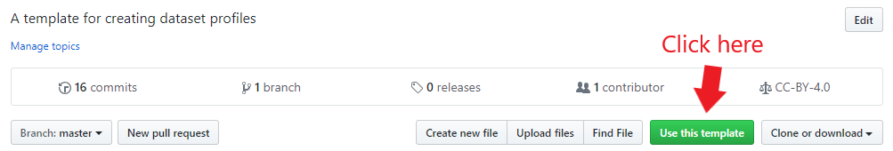
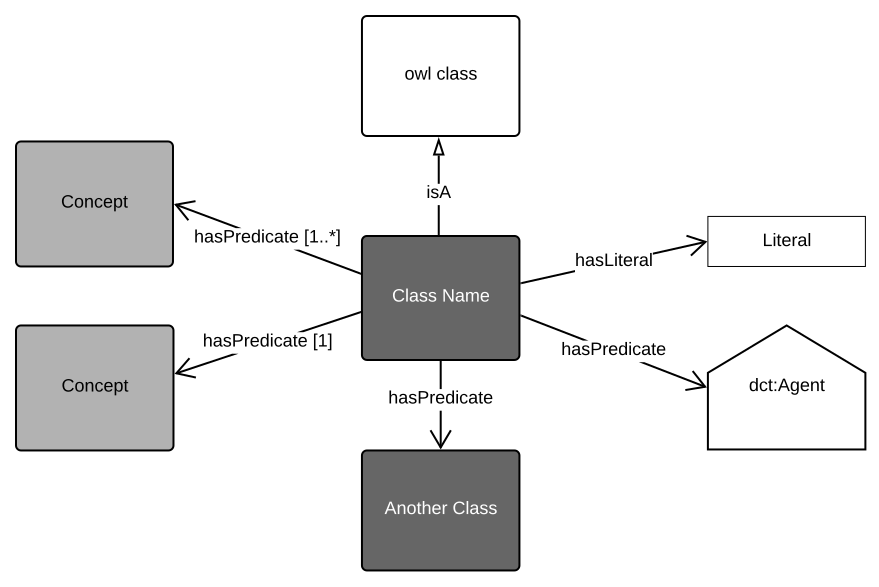
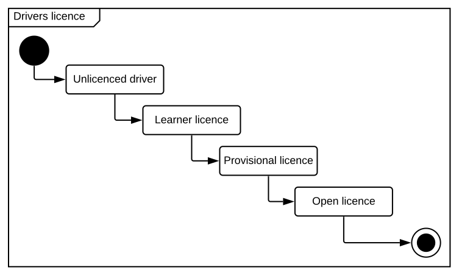

> **This is a template for creating GSQ Dataset Profiles.**  
> This page uses [Markdown](https://help.github.com/en/articles/basic-writing-and-formatting-syntax) for text formatting.  
> Recommended reading:  
> * [What is a dataset profile?](https://github.com/geological-survey-of-queensland/gsq-info-model/wiki/What-is-a-Dataset-Profile%3F)  
> * [How to create a dataset profile?](https://github.com/geological-survey-of-queensland/gsq-info-model/wiki/How-to-create-a-dataset-profile)  
>
> To use this template for a new profile, click the **Use this template** button. See [full instructions](https://help.github.com/en/articles/creating-a-repository-from-a-template).  
> 
>
> _NOTE: Remove this text block when no longer required._ :sunglasses:
___

# Dataset Profile Name
Provide a short introduction to the profile to help the reader understand the context and purpose of the dataset profile.

 
Figure 1: Add title of graphic

Add additional text as required to explain the profile.

# Dataset Subclass Profile Name (optional)
Show a subclass where necessary to educate the reader. e.g. A `survey` profile shows a `seismic survey` - a specific type of `survey`.

 
Figure 2: Add title of graphic

# Dataset Profile Usage (optional)
Explain the usage of the dataset profile using both textual and graphical means. This section helps the reader understand the profile and how it is used in the real world.

Consider using an [activity diagram](https://www.lucidchart.com/pages/uml-activity-diagram), [state diagram](https://www.lucidchart.com/pages/uml-state-machine-diagram), or [sequence diagram](https://www.lucidchart.com/pages/uml-sequence-diagram) to explain process flows and temporal states.

 
Figure 3: Add title of graphic

## Profile Resources
This profile is presented as a series of files that perform different roles:

1. [model/](model/) - the *model* folder contains this profile's models in both graphical (SVG) and machine-readable, textual, form ( [RDF](https://www.w3.org/RDF/) turtle).
2. [shapes/](shapes/) - folder containing SHACL shapes files used to validate data's conformance to this profile's model.
3. [profile.ttl](profile.ttl) - the profile declaration. A description of all of the items in this profile (the formal model, validating resources, documentation etc.) according to the W3C's [Profiles Ontology](https://www.w3.org/TR/dx-prof/) which describes how all the parts related to one another, the roles they play (to give *guidance* for use, to *validate* data etc.) and how this profile *profiles* the various standards listed above.

## GSQ classes
> This section lists the GSQ classes that feature in the model. Use links to those classes. Delete the examples listed below as required.

Classes used in this profile:
1. [Queensland Mining Permit](https://github.com/geological-survey-of-queensland/gsq-permit-profile) - used if the report relates to a permit(s)
2. [GSQ Survey Profile](https://github.com/geological-survey-of-queensland/gsq-survey-profile) - used if the report is the result of a survey event

## OWL classes
> This section lists the OWL classes (the internationally defined classes).  Delete the examples listed below as required.
1. [dcat:Dataset](https://w3c.github.io/dxwg/dcat/#Class:Dataset) - industry report is a special type of dataset
2. [dcat:Theme](https://w3c.github.io/dxwg/dcat/#Property:resource_theme) - used to categorise the resource, the GSQ themes are described as [skos:Concept](http://www.w3.org/2004/02/skos/core#Concept)s in the vocabulary [GSQ Data Themes](http://vocabs.gsq.digital/vocabulary/gsq-data-themes)
3. [dcat:Distribution](https://w3c.github.io/dxwg/dcat/#Class:Distribution)
4. [dct:Location](https://w3c.github.io/dxwg/dcat/#Class:Location) - spatial coverage of the report expressed as lat/long, centroid, bounding box or simple polygon
5. [dct:creator](https://w3c.github.io/dxwg/dcat/#Property:resource_creator) - the author of the report
6. [dct:publisher](https://w3c.github.io/dxwg/dcat/#Property:resource_publisher) - GSQ
7. [dct:contactPoint](https://w3c.github.io/dxwg/dcat/#Property:resource_contact_point) - GSQ contact
8. [dct:title](https://w3c.github.io/dxwg/dcat/#Property:resource_title) - report title
9. [dct:description](https://w3c.github.io/dxwg/dcat/#Property:resource_description)
10. [dct:identifier](https://w3c.github.io/dxwg/dcat/#Property:resource_identifier) - report number
11. [dct:license](https://w3c.github.io/dxwg/dcat/#Property:resource_license) - not shown in diagram for readability
12. [dcat:keyword](https://w3c.github.io/dxwg/dcat/#Property:resource_keyword) - not shown in diagram for readability
13. [foaf:Agent](http://xmlns.com/foaf/spec/#term_Agent)
14. [rdfs:seeAlso](https://www.w3.org/TR/rdf-schema/#ch_seealso) - refers to secondary metadata
15. [FOAF document](http://xmlns.com/foaf/spec/#term_Document) - a document with secondary metadata
16. [ProperInterval](https://www.w3.org/TR/owl-time/#time:ProperInterval) - the temporal coverage of the report
17. [dct:created](https://w3c.github.io/dxwg/dcat/)
18. [dct:issued](https://w3c.github.io/dxwg/dcat/#Property:resource_release_date) - date of formal issuance (e.g., open file publication)
19. [dct:modified](https://w3c.github.io/dxwg/dcat/#Property:resource_update_date) - most recent date on which the item was changed, updated or modified

### [Distribution](https://w3c.github.io/dxwg/dcat/#Class:Distribution) properties not shown in the diagram:
> Keep the diagram simple by listing the secondary properties here instead of in the diagram.  
1. [Title](https://w3c.github.io/dxwg/dcat/#Property:distribution_title)
2. [Description](https://w3c.github.io/dxwg/dcat/#Property:distribution_description)
3. [Download URL](https://w3c.github.io/dxwg/dcat/#Property:distribution_download_url)
4. [Byte size](https://w3c.github.io/dxwg/dcat/#Property:distribution_size)
5. [Format](https://w3c.github.io/dxwg/dcat/#Property:distribution_format)

## Vocabularies
> List the vocabularies and link to them if published. Delete the examples listed below as required.

The vocabularies used in this profile are:
1. [GSQ Data Themes](http://vocabs.gsq.digital/vocabulary/gsq-data-themes)
2. [Earth Science Data Category](https://vocabs.gsq.digital/vocabulary/earth-science-data-category) - the category(s) of data contained in the report
3. [Geoscience Feature of Interest](https://vocabs.gsq.digital/vocabulary/geoscience-foi)
4. [Data Access Rights](http://vocabs.gsq.digital/vocabulary/data-access)

## Licence
The content of this repository is licensed for use with the [Creative Commons 4.0 License](https://creativecommons.org/licenses/by/4.0/). See the [license deed](LICENSE) for details.

## Contacts 
*owner*:  
**Mark Gordon**  
*Director - Geoscience Information*  
Geological Survey of Queensland  
<mark.gordon@dnrme.qld.gov.au>  

*author*:  
**Your Name**  
*Your Role Title - Your Unit*  
Geological Survey of Queensland  
<your.email@dnrme.qld.gov.au>

___
**Profile Status:** Draft
