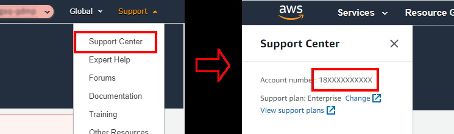

# How to share data with GSQ

You can share files with GSQ over the internet. This is good if you have large files, or a lot of files, that you need to share.  

## Copy files from your S3 to GSQ's S3

We use Amazon's AWS platform for cloud data storage. We store data objects (files) in S3 buckets (simple storage service).

### Step 1: Get GSQ's 12 digit AWS account number (the *destination*)

<p align="center">
<br>
Figure 1: Add title of graphic</p>

1. Sign into the GSQ account for the *destination* S3 bucket.
1. Click **Support** -> **Support Center** and copy the 12 digit AWS account number. This number is the Amazon Resource Name (ARN) of the destination account.

### Step 2: Attach a policy to the *source* S3 bucket

Attaching this policy to the *source* S3 bucket allows the GSQ *destination* account to perform the ListBucket and GetObject commands on the *source* S3 bucket.  

By default, an S3 object is owned by the account that uploaded the object. That's why granting the destination account the permissions to perform the cross-account copy makes sure that the destination owns the copied objects.  

1. Sign in to *source* AWS account.  
2. Attach the following policy to the *source* bucket (see [how-to](https://docs.aws.amazon.com/AmazonS3/latest/dev/example-bucket-policies.html)).  
3. Change the value of the **Principal** to GSQ's ARN obtained in Step 1.

```json
{
    "Version": "2012-10-17",
    "Statement": [
        {
            "Sid": "DelegateS3Access",
            "Effect": "Allow",
            "Principal": {
                "AWS": "arn:aws:iam::QSQ_ARN_ACCOUNT_NUMBER:root"
            },
            "Action": [
                "s3:ListBucket",
                "s3:GetObject"
            ],
            "Resource": [
                "arn:aws:s3:::SOURCE_BUCKET_NAME/*",
                "arn:aws:s3:::SOURCE_BUCKET_NAME"
            ]
        }
    ]
}
```

### Step 3: Attach a policy to the *destination* GSQ Admin IAM role

Attaching this policy in the GSQ account allows users in the GSQ Admin Role to copy objects from the *source* bucket to the *destination* bucket.  

1. Sign in to *destination* GSQ AWS account and change Role to the GSQ Admin Role.  
2. Create the following policy in the IAM Concolse (see [how-to](https://docs.aws.amazon.com/IAM/latest/UserGuide/access_policies_create-console.html)).  
3. Change the value of the **SOURCE_BUCKET_NAME** and **DESTINATION_BUCKET_NAME**.

```json
{
    "Version": "2012-10-17",
    "Statement": [
        {
            "Effect": "Allow",
            "Action": [
                "s3:ListBucket",
                "s3:GetObject"
            ],
            "Resource": [
                "arn:aws:s3:::SOURCE_BUCKET_NAME",
                "arn:aws:s3:::SOURCE_BUCKET_NAME/*"
            ]
        },
        {
            "Effect": "Allow",
            "Action": [
                "s3:ListBucket",
                "s3:PutObject",
                "s3:PutObjectAcl"
            ],
            "Resource": [
                "arn:aws:s3:::DESTINATION_BUCKET_NAME",
                "arn:aws:s3:::DESTINATION_BUCKET_NAME/*"
            ]
        }
    ]
}
```

### Step 4:  Sync S3 objects to destination

1. Open the AWS CLI.  
2. Copy S3 buckets from the *source* to *destination* using the following AWS CLI command:

```cmd
aws s3 sync s3://awsexamplesourcebucket s3://awsexampledestinationbucket
```

#### Step 4a: How to copy across regions

```cmd
aws s3 sync s3://SOURCE-BUCKET-NAME s3://DESTINATION-BUCKET-NAME --source-region SOURCE-REGION-NAME --region DESTINATION-REGION-NAME
```

### Important

* If the source or destination bucket has [default encryption](https://docs.aws.amazon.com/AmazonS3/latest/dev/bucket-encryption.html) with AWS Key Management Service (AWS KMS) enabled, then you must also modify the permissions related to the AWS KMS key. For instructions, see [My Amazon S3 bucket has default encryption using a custom AWS KMS key. How can I allow users to download from and upload to the bucket?](https://aws.amazon.com/premiumsupport/knowledge-center/s3-bucket-access-default-encryption/)  

## Licence

The content of this repository is licensed for use with the [Creative Commons 4.0 License](https://creativecommons.org/licenses/by/4.0/). See the [license deed](LICENSE) for details.


## Contacts 
*owner*:  
**Mark Gordon**  
*Director - Geoscience Information*  
Geological Survey of Queensland  
<mark.gordon@dnrme.qld.gov.au>  

*author*:  
**Matthew Greenwood**  
*Manager, Regional Compilations, Mineral Geoscience*  
Geological Survey of Queensland  
<Matthew.Greenwood@dnrme.qld.gov.au>
